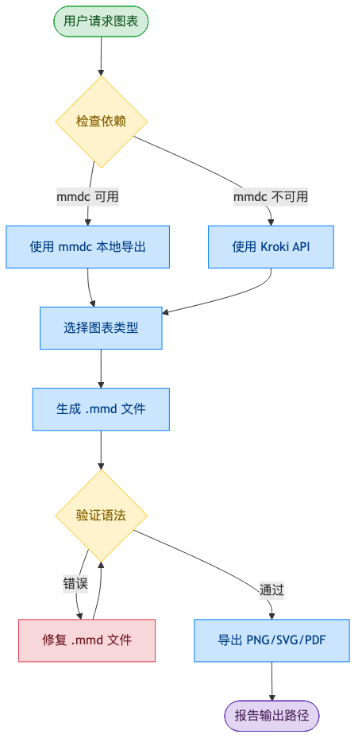
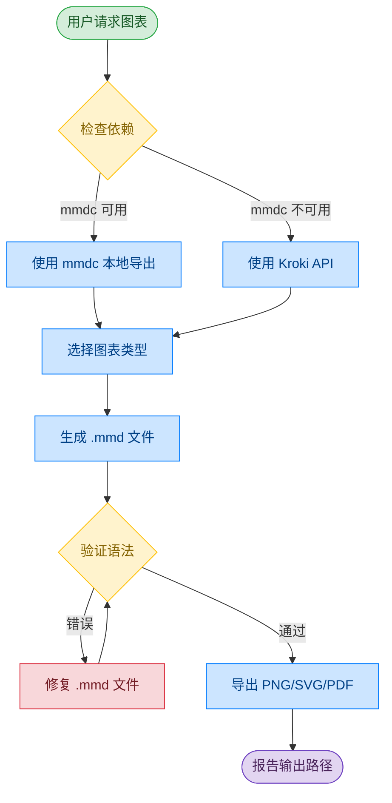

# creating-mermaid-diagrams

Claude Code 技能：生成 Mermaid 图表并导出为 PNG/SVG/PDF。

[English](README.md)

## 为什么选择这个技能？

| 特性 | 本技能 | 其他 Mermaid 技能 | MCP 服务器 |
|------|--------|------------------|------------|
| **导出前验证** | ✓ 必须步骤 | 经常跳过 | 不一定 |
| **渐进式加载** | ✓ 语法分离到独立文件 | 全部内联 | 不适用 |
| **主动触发** | ✓ 3+组件自动触发 | 仅手动 | 仅手动 |
| **中文支持** | ✓ 画图、架构图、流程图、时序图 | 仅英文 | 仅英文 |
| **输入输出示例** | ✓ 3个完整示例 | 通常没有 | 没有 |
| **双重导出方式** | ✓ mmdc（本地）+ Kroki（API） | 通常只有一种 | 仅网页 |
| **零安装备选** | ✓ Kroki 只需 curl | 需要安装 | 需要配置 |

**核心优势：**
- **提前捕获错误** — 验证循环防止生成损坏的图表
- **Token 高效** — 详细语法仅在需要时加载
- **灵活导出** — 本地 mmdc 或 Kroki API（无需安装）
- **双语支持** — 中英文关键词都能触发

## 这个技能能做什么

### 图表类型（11+种）

| 类型 | 用途 | 示例 |
|------|------|------|
| **流程图** | 流程、管道、决策树 | CI/CD 管道、用户注册流程 |
| **时序图** | API 调用、认证流程 | JWT 认证、微服务通信 |
| **类图** | OOP 模型、数据结构 | 领域模型、继承层次 |
| **ER 图** | 数据库 Schema | 用户-订单-商品关系 |
| **状态图** | 状态机、生命周期 | 订单状态、连接状态 |
| **甘特图** | 项目时间线 | Sprint 规划、发布计划 |
| **饼图** | 比例、分布 | 市场份额、资源分配 |
| **Git 图** | 分支策略 | GitFlow、主干开发 |
| **C4 上下文图** | 高级架构 | 系统上下文、容器图 |
| **思维导图** | 主题分解 | 功能规划、头脑风暴 |

### 输出格式

- **PNG** — 高分辨率（2048px），白色背景，多种主题
- **SVG** — 可缩放矢量图，适合文档
- **PDF** — 可打印文档

### 自动触发

技能在以下情况自动激活：
- 明确请求图表：*"创建流程图"*、*"画架构图"*
- 解释复杂系统：*"认证是怎么工作的"*（3+组件）
- 使用中文：*"画一个时序图"*、*"架构图"*

## 如何使用这个技能

### 1. 安装技能

```bash
# 克隆到 Claude Code 技能目录
git clone https://github.com/Agents365-ai/creating-mermaid-diagrams.git ~/.claude/skills/creating-mermaid-diagrams
```

或者用于特定项目：
```bash
git clone https://github.com/Agents365-ai/creating-mermaid-diagrams.git .claude/skills/creating-mermaid-diagrams
```

### 2. 安装依赖

**方式 A：本地导出（mmdc）**
```bash
npm install -g @mermaid-js/mermaid-cli
mmdc --version
```

**方式 B：Kroki API（无需安装）**
```bash
# 只需要 curl，无需安装任何东西！
curl --version
```

使用 Kroki 的场景：
- `mmdc` 安装失败（Chromium 问题）
- CI/CD 环境没有 Node.js
- 快速生成单个图表

### 3. 开始使用

在 Claude Code 中描述你想要的：

```
创建一个用户认证的时序图，使用 JWT
```

```
画一个电商微服务架构图
```

```
Draw an e-commerce microservices architecture
```

Claude 会：
1. 生成 `.mmd` 源文件
2. **验证语法**（在导出前捕获错误）
3. 导出为 PNG/SVG/PDF
4. 报告输出文件路径

## 工作流程

本技能采用验证优先的工作流：



<details>
<summary>查看 Mermaid 源码</summary>



**颜色图例：** 🟢 输入 | 🔵 处理 | 🟡 决策 | 🔴 警告 | 🟣 输出

</details>

## 示例输出

**提示词：**
> 创建一个微服务电商架构，包含 API 网关、各种服务和数据库

**生成结果：**


## 文件结构

```
creating-mermaid-diagrams/
├── SKILL.md              # 主技能说明
├── reference/
│   ├── FLOWCHART.md      # 流程图语法和示例
│   ├── SEQUENCE.md       # 时序图语法
│   ├── CLASS-ER.md       # 类图和 ER 图语法
│   └── OTHER-TYPES.md    # 状态图、甘特图、Git图、饼图、思维导图、C4
├── assets/
│   ├── example.mmd       # 示例：微服务架构
│   ├── example.png
│   ├── workflow.mmd      # 示例：工作流（英文）
│   ├── workflow.png
│   ├── workflow_cn.mmd   # 示例：工作流（中文）
│   └── workflow_cn.png
├── README.md
└── README_CN.md
```

## 支持作者

如果这个技能对你有帮助，欢迎支持作者：

<table>
  <tr>
    <td align="center">
      
      <br>
      <b>微信支付</b>
    </td>
    <td align="center">
      
      <br>
      <b>支付宝</b>
    </td>
    <td align="center">
      
      <br>
      <b>Buy Me a Coffee</b>
    </td>
  </tr>
</table>

## 许可证

MIT

## 作者

**Agents365-ai**

- GitHub: https://github.com/Agents365-ai
- Bilibili: https://space.bilibili.com/441831884
