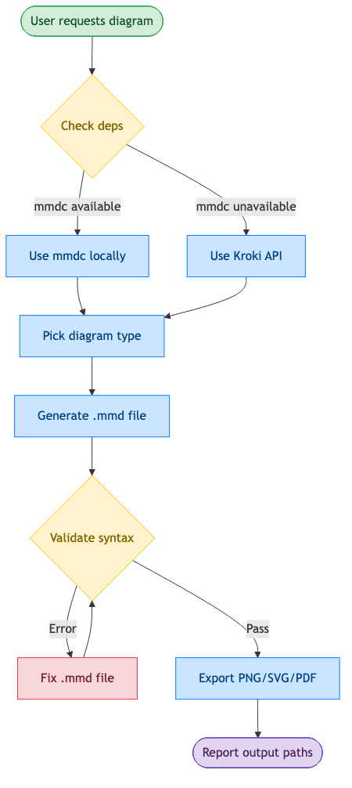
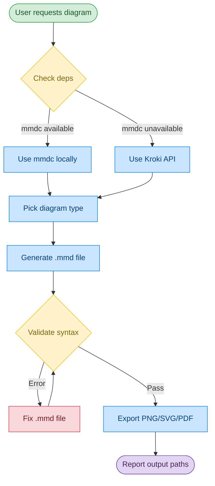
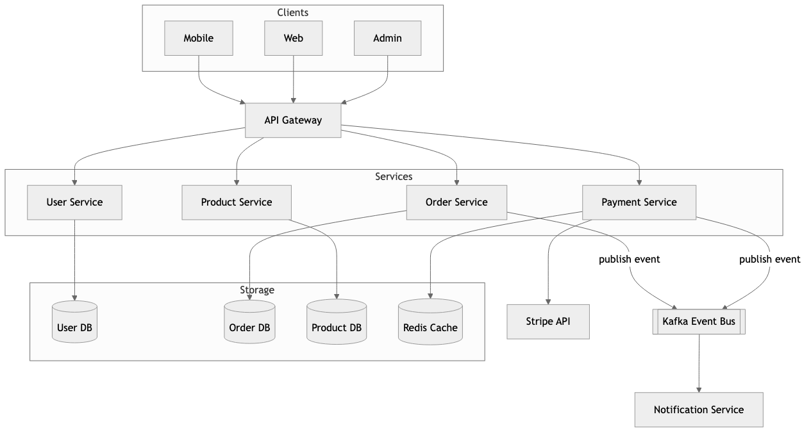

# Mermaid Diagrams — From Code to Image, Automatically

A Claude Code skill that generates, validates, and exports Mermaid diagrams to PNG/SVG/PDF.

[中文文档](README.md)

## Why This Skill?

| Feature | This Skill | Native Claude Code | Other Skills | MCP Server |
|---------|-----------|-------------------|--------------|------------|
| **Write Mermaid syntax** | ✓ Guided by examples | ✓ Built-in capability | ✓ Varies | ✓ Varies |
| **Validation before export** | ✓ Required step | ✗ No validation loop | Often skipped | Varies |
| **Export to PNG/SVG/PDF** | ✓ Automatic | ✗ Manual — user must ask | Usually one method | Web only |
| **Zero-install fallback** | ✓ Kroki needs only curl | ✗ No fallback | Requires install | Requires setup |
| **Proactive triggering** | ✓ Auto-triggers for 3+ components | ✗ Only when explicitly asked | Manual only | Manual |
| **Chinese language support** | ✓ Chinese keyword triggers | ✗ No keyword triggers | English only | English only |
| **End-to-end workflow** | ✓ Generate → Validate → Export → Report | ✗ Generate only | Partial | Partial |
| **Progressive disclosure** | ✓ Syntax in separate files | N/A | All inline | N/A |

**Key advantages over native Claude Code:**
- **Complete pipeline** — Claude Code can write Mermaid, but stops at `.mmd`. This skill adds validation, export, and error recovery automatically
- **Catches errors early** — validation loop prevents broken diagrams from being exported
- **Flexible export** — local mmdc or Kroki API fallback (no install needed)
- **Proactive diagramming** — auto-triggers when discussing architecture, not just when you ask for a diagram

## What This Skill Can Do

### Diagram Types (11+)

| Type | Use for | Example |
|------|---------|---------|
| **Flowchart** | Processes, pipelines, decision trees | CI/CD pipeline, user registration flow |
| **Sequence** | API calls, authentication flows | JWT auth, microservice communication |
| **Class** | OOP models, data structures | Domain models, inheritance hierarchies |
| **ER** | Database schemas | User-Order-Product relationships |
| **State** | State machines, lifecycles | Order status, connection states |
| **Gantt** | Project timelines | Sprint planning, release schedules |
| **Pie** | Proportions, distributions | Market share, resource allocation |
| **Git Graph** | Branch strategies | GitFlow, trunk-based development |
| **C4 Context** | High-level architecture | System context, container diagrams |
| **Mind Map** | Topic breakdowns | Feature planning, brainstorming |

### Output Formats

- **PNG** — High resolution (2048px), white background, multiple themes
- **SVG** — Scalable vector, perfect for docs
- **PDF** — Print-ready documents

### Automatic Triggering

The skill activates when you:
- Ask for diagrams explicitly: *"create a flowchart"*, *"draw architecture"*
- Explain complex systems: *"how does authentication work"* (3+ components)
- Use Chinese: *"draw a sequence diagram"*, *"architecture diagram"* (in Chinese)

## How to Use This Skill

### 1. Install the Skill

```bash
# Clone to your Claude Code skills directory
git clone https://github.com/Agents365-ai/creating-mermaid-diagrams.git ~/.claude/skills/creating-mermaid-diagrams
```

Or for project-specific use:
```bash
git clone https://github.com/Agents365-ai/creating-mermaid-diagrams.git .claude/skills/creating-mermaid-diagrams
```

### 2. Install Dependencies

**Option A: Local Export (mmdc)**
```bash
npm install -g @mermaid-js/mermaid-cli
mmdc --version
```

**Option B: Kroki API (no install)**
```bash
# Just need curl - no installation required!
curl --version
```

Use Kroki when:
- `mmdc` installation fails (Chromium issues)
- Running in CI/CD without Node.js
- Quick one-off diagrams

### 3. Use It

Just describe what you want in Claude Code:

```
Create a sequence diagram for user authentication with JWT
```

```
Draw an e-commerce microservices architecture
```

Claude will:
1. Generate `.mmd` source file
2. **Validate syntax** (catches errors before export)
3. Export to PNG/SVG/PDF
4. Report output file paths

## How It Works

This skill follows a validation-first workflow:



<details>
<summary>View Mermaid source</summary>



**Color legend:** 🟢 Input | 🔵 Process | 🟡 Decision | 🔴 Warning | 🟣 Output

</details>

## Example Output

**Prompt:**
> Create a microservices e-commerce architecture with API Gateway, services, and databases

**Generated:**



## File Structure

```
creating-mermaid-diagrams/
├── SKILL.md              # Main skill instructions
├── reference/
│   ├── FLOWCHART.md      # Flowchart syntax & examples
│   ├── SEQUENCE.md       # Sequence diagram syntax
│   ├── CLASS-ER.md       # Class & ER diagram syntax
│   └── OTHER-TYPES.md    # State, Gantt, Git, Pie, Mindmap, C4
├── assets/
│   ├── example.mmd       # Example: microservices architecture
│   ├── example.png
│   ├── workflow.mmd      # Example: workflow (English)
│   ├── workflow.png
│   ├── workflow_cn.mmd   # Example: workflow (Chinese)
│   └── workflow_cn.png
├── README.md             # Chinese docs (default)
└── README_EN.md          # English docs
```

## Support

If this skill helps you, consider supporting the author:

<table>
  <tr>
    <td align="center">
      
      <br>
      <b>WeChat Pay</b>
    </td>
    <td align="center">
      
      <br>
      <b>Alipay</b>
    </td>
    <td align="center">
      
      <br>
      <b>Buy Me a Coffee</b>
    </td>
  </tr>
</table>

## License

MIT

## Author

**Agents365-ai**

- GitHub: https://github.com/Agents365-ai
- Bilibili: https://space.bilibili.com/441831884
